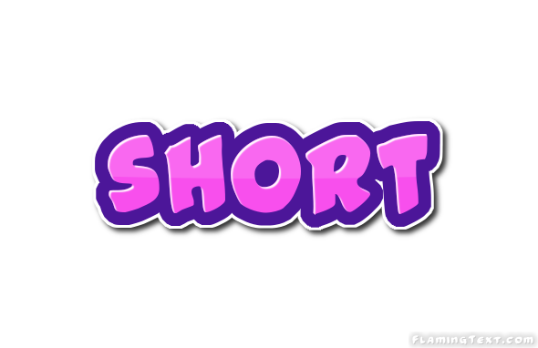

# Cut It Short - Data Summarization Web Application

**Cut It Short** is a web application that summarizes any given text data, providing concise summaries of lengthy content. This application uses **Flask** for backend processing and integrates with Hugging Face's summarization API for generating summaries.



---

## Features

- **Text Summarization**: Input any length of text to receive a summarized output.
- **Customizable Summary Length**: Set the preferred length of the summary with an adjustable range.
- **Responsive UI**: The frontend is styled with Tailwind CSS for a clean and responsive layout.

---

## Tech Stack

- **Frontend**: HTML, CSS, [Tailwind CSS](https://tailwindcss.com/)
- **Backend**: Python (Flask)
- **API**: [Hugging Face](https://huggingface.co/)

---

## Getting Started

To set up and run the application locally, follow these steps:

### Prerequisites

- Python 3.6 or later
- Flask
- Requests library

### Installation

1. Clone the repository:
   ```bash
   git clone https://github.com/your-username/cut-it-short.git
   cd cut-it-short

2. Install the required libraries
	```bash
	pip install flask requests
	
3. Obtain an API key from Hugging Face and replace your key here in app.py with your API key
	```bash
	headers = {"Authorization": f"Bearer your_key_here"}
	
4. Run the application
	```bash
	python app.py
	
5. Open a browser and navigate to http://127.0.0.1:5000 to access the application.


### Usage

1. Enter the text you want to summarize in the input field.
2. Adjust the Summary Length slider to set the desired summary length.
3. Click Submit to generate the summary.
4. View and copy the generated summary using the Copy Text button.

### License

This project is licensed under the MIT License.
